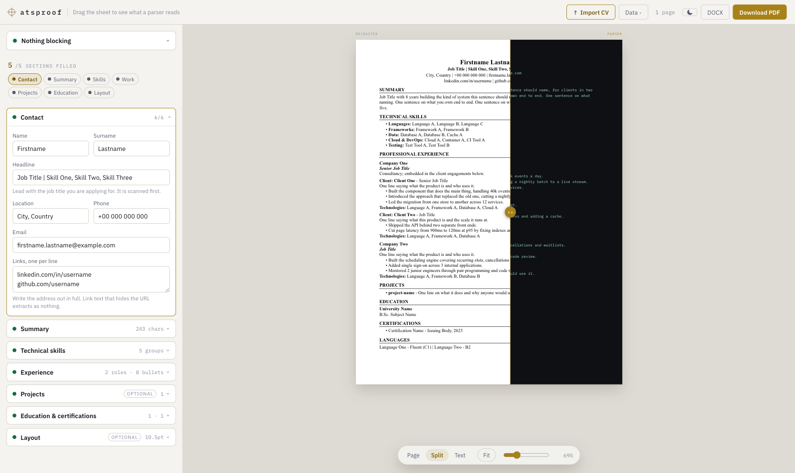
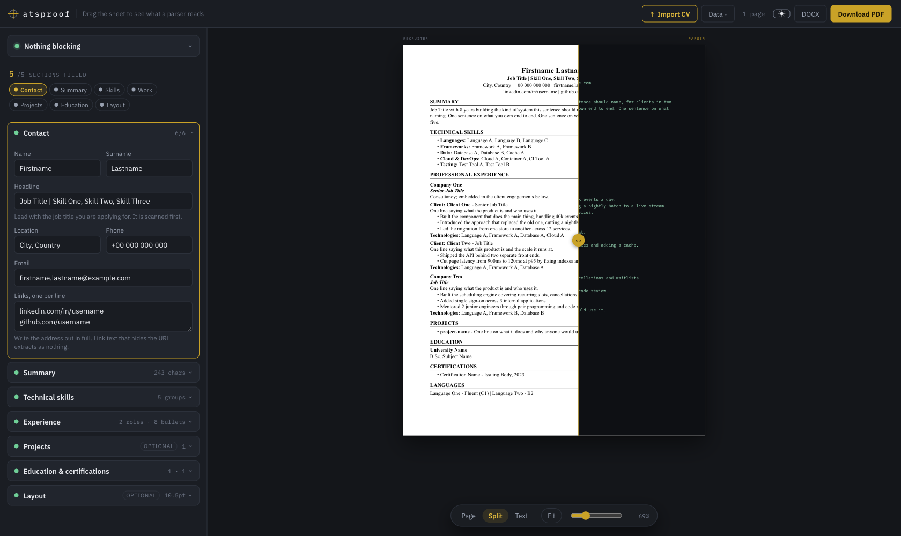
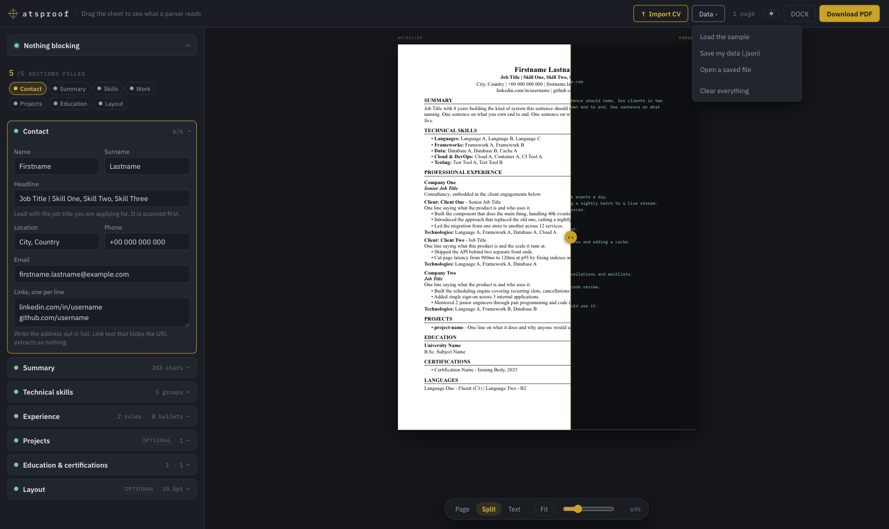

# atsproof

Fill in a form, get a CV that applicant tracking systems can actually read.

A CV can look immaculate and still extract as nothing useful. Bullets get severed
from the job they belong to, contact details sit in a header the parser skips, a
two-column layout reorders on the way out. This builder shows you both sides: the
typeset page a recruiter sees, and the raw text stream a parser sees.

Runs entirely in the browser. No backend, no account, nothing uploaded.



## What it does

- **The X-ray scrub** — drag the handle across the sheet. Left of it is the
  typeset page a recruiter sees; right of it is the same page as the text an ATS
  actually extracts
- **Live checks** — missing contact details, roles with no bullets, characters
  older parsers mangle, bullets with no numbers in them
- **Real page breaks** — the preview paginates with the exporter's own
  paginator, so where the page ends on screen is where it ends in the file
- **PDF export** — real selectable text using the PDF core Times face. Not a
  canvas screenshot; an image-based PDF extracts as nothing at all
- **DOCX export** — several systems parse Word more reliably than PDF, and some
  portals accept nothing else
- **Import an existing CV** — drop in a PDF, DOCX or TXT and the form fills
  itself. Heuristic, so it tells you what it recognised and asks you to check
- **Save / load** your data as JSON, with autosave to local storage
- **Light and dark**, remembered between visits



## Importing a CV

Click **Import CV** in the top bar and pick a PDF, DOCX or TXT. Everything else
lives under **Data**:



| Menu item | What it does |
| --- | --- |
| Load the sample | Replaces the form with a worked example |
| Save my data (.json) | Downloads your answers so you can come back to them |
| Open a saved file | Loads a `.json` you saved earlier |
| Clear everything | Empties the form |

Import is best-effort: there is no standard for CV layout, so it matches the
section headings people actually use and reads each block by shape. On a
conventionally formatted CV it recovers contact details, skills, and every role
with its dates, location and bullets. On an unusual one it will get some of it
wrong, which is why the result lands in the form for review rather than straight
into a file. If a file barely parses, it says so instead of showing you a
confidently wrong form.

## Why the output parses

- One column. No tables, text boxes, images, headers or footers
- Standard section headings (`SUMMARY`, `PROFESSIONAL EXPERIENCE`, `EDUCATION`)
- ASCII punctuation only — smart quotes and en-dashes are rewritten, and
  accents are folded rather than deleted, so "Müller" exports as "Muller"
- Links written out as full URLs, so anchor-stripping parsers still see them
- A role and its bullets form one atomic block, so no job splits across a page
  break

## Running it

```bash
npm install
npm start        # http://localhost:4200
npm test         # unit tests
npm run build    # production build into dist/
```

Requires Node 22.22.3+, 24.15+, or 26+.

## Deploying

Pushing to `main` builds and publishes to GitHub Pages via
`.github/workflows/deploy.yml`. Enable it once under **Settings → Pages → Source
→ GitHub Actions**.

The workflow derives `--base-href` from the repository name, writes `.nojekyll`,
and copies `index.html` to `404.html` so deep links resolve.

## Layout

```
src/app/
  app.ts                     shell: toolbar, view switching, export actions
  features/cv/
    models/                  the CV document type
    state/                   signal store, autosave, sample data
    domain/                  layout blocks + the ATS checks
    export/                  PDF and DOCX writers
    ui/                      form, checks, page preview, x-ray sheet
```

`domain/cv-layout.ts` is the single source of truth: it turns the CV into an
ordered list of text blocks, and the preview, the PDF writer and the DOCX writer
all render from that same list — so the preview cannot drift from the download.

## Licence

MIT.
